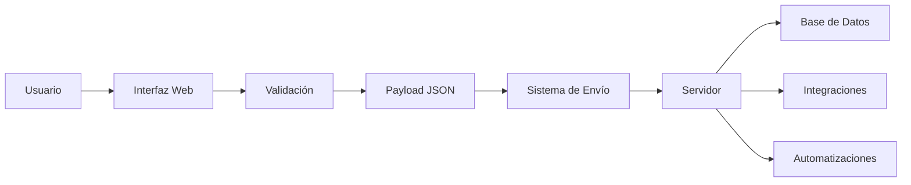
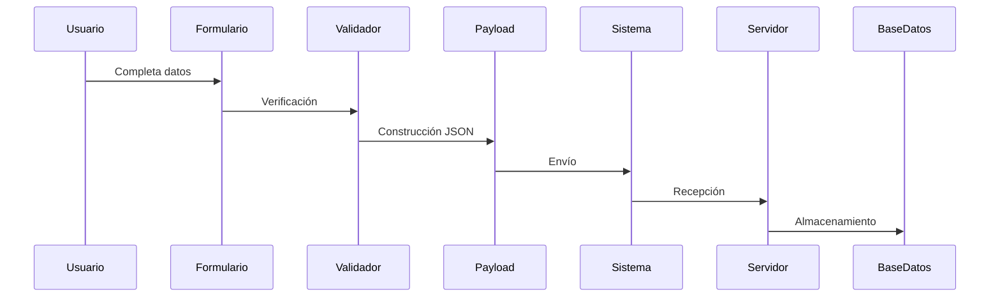

# Guía Completa para Crear Webs Compatibles con Websites

## Introducción

Este proyecto utiliza una arquitectura modular diseñada para permitir que múltiples sitios web compartan la misma infraestructura de procesamiento de datos sin necesidad de modificar el sistema principal.

El objetivo es que cualquier desarrollador pueda crear una nueva interfaz simplemente cambiando la apariencia visual y, si es necesario, agregando nuevos campos de información sin romper la compatibilidad con el ecosistema.

---

# Filosofía del Proyecto

La lógica de negocio, procesamiento y envío de datos se encuentra centralizada.

Cada sitio web actúa únicamente como una capa de presentación encargada de:

- Mostrar información al usuario.
- Capturar datos.
- Validar formularios.
- Enviar la información utilizando el formato definido por el sistema.

Esto permite mantener una única infraestructura mientras se despliegan múltiples sitios con diseños completamente distintos.

---

# Arquitectura General



---

# Estructura Recomendada

```text
/
│
├── index.html
│
├── assets/
│   ├── images/
│   ├── icons/
│   └── fonts/
│
├── css/
│   ├── style.css
│   └── responsive.css
│
├── js/
│   ├── app.js
│   ├── validator.js
│   └── sender.js
│
├── config/
│   └── config.json
│
└── README.md
```

---

# Componentes del Sistema

## HTML

Contiene la estructura visual.

Ejemplos:

- Formularios
- Botones
- Menús
- Tarjetas
- Tablas
- Ventanas emergentes

Puede modificarse libremente siempre que se respeten los identificadores utilizados por JavaScript.

---

## CSS

Controla la apariencia.

Se puede modificar completamente:

- Colores
- Espaciado
- Tipografías
- Sombras
- Bordes
- Temas
- Animaciones

No afecta la compatibilidad del sistema.

---

## JavaScript

Aquí se encuentra la comunicación con el backend.

Algunas partes pueden modificarse.

Otras son obligatorias.

---

# Elementos Obligatorios

Los siguientes componentes deben mantenerse.

## Función de envío

```javascript
sendData()
```

---

## Función principal

```javascript
submitForm()
```

---

## Endpoint

```javascript
apiEndpoint
```

---

## Webhook

```javascript
webhookURL
```

---

## Estructura del Payload

```javascript
{
    nombre,
    correo,
    telefono
}
```

---

# Elementos que Sí Pueden Modificarse

## Colores

Ejemplo:

```css
:root{
    --primary:#3498db;
    --secondary:#2ecc71;
}
```

---

## Tipografías

```css
font-family:Arial,sans-serif;
```

---

## Animaciones

```css
transition:0.3s;
```

---

## Diseño

Se permite:

- Landing Pages
- Dashboards
- Paneles
- Formularios Multipaso
- Tiendas
- Blogs
- Catálogos

---

# Agregar Nuevos Campos

Si se requiere recopilar más información se pueden crear nuevos campos.

---

## Paso 1

Agregar el campo visual.

```html
<input
    id="ciudad"
    type="text"
    placeholder="Ciudad"
/>
```

---

## Paso 2

Capturar el valor.

```javascript
const ciudad =
document.getElementById("ciudad").value;
```

---

## Paso 3

Añadirlo al payload.

```javascript
const data = {
    nombre,
    correo,
    telefono,
    ciudad
};
```

---

## Resultado

```json
{
  "nombre":"Juan",
  "correo":"juan@gmail.com",
  "telefono":"3000000000",
  "ciudad":"Bogotá"
}
```

---

# Flujo de Datos



---

# Compatibilidad Garantizada

Una web será considerada compatible cuando:

### Cumpla

- Mantener la función de envío.
- Mantener el endpoint.
- Mantener la estructura base.
- Utilizar HTTPS.
- Enviar JSON válido.

### No Cumpla

- Cambiar rutas críticas.
- Alterar funciones internas.
- Modificar nombres requeridos.
- Romper el formato de envío.

---

# Temas Personalizados

Es posible implementar múltiples temas.

Ejemplo:

```css
[data-theme="dark"]
```

```css
[data-theme="light"]
```

```css
[data-theme="red"]
```

```css
[data-theme="blue"]
```

---

# Compatibilidad Móvil

Toda web nueva debe ser responsive.

Recomendado:

```css
@media(max-width:768px)
```

---

# Rendimiento

Recomendaciones:

- Comprimir imágenes.
- Minimizar CSS.
- Minimizar JavaScript.
- Utilizar lazy loading.
- Reducir solicitudes innecesarias.

---

# Seguridad

Recomendado:

- Validar entradas.
- Sanitizar datos.
- Limitar longitud de campos.
- Utilizar HTTPS.
- Evitar ejecutar código enviado por usuarios.

---

# Escalabilidad

La arquitectura permite:

- Múltiples diseños.
- Múltiples dominios.
- Múltiples formularios.
- Múltiples integraciones.
- Múltiples bases de datos.

Sin modificar la lógica principal.

---

# Ejemplo de Compatibilidad

Sitio A:

```text
Diseño Azul
```

Sitio B:

```text
Diseño Oscuro
```

Sitio C:

```text
Diseño Corporativo
```

Todos pueden utilizar exactamente el mismo sistema de procesamiento de datos.

---

# Regla Principal

Si la web conserva:

1. El sistema de envío.
2. El formato JSON.
3. La comunicación con el backend.

Puede modificarse cualquier elemento visual sin perder compatibilidad con Websites.
